# Tiny Language — Compiler Project Roadmap

## Language Overview

**Tiny** is a statically-typed, imperative language designed to exercise the full
ANTLR4 → C++ → LLVM IR pipeline without drowning in complexity.

| Feature | LLVM Concept Exercised |
|---|---|
| `int`, `float`, `bool` | `i64`, `double`, `i1` types |
| `let` / `var` | `alloca` + `store` / `load`, immutability checks |
| Arithmetic & comparison | `add`, `fadd`, `icmp`, `fcmp` instructions |
| `if` / `else` | Basic blocks, conditional `br`, phi nodes (or alloca) |
| `while`, `for..in` | Loop basic blocks, back-edges |
| Functions | `define`, `call`, `ret`, parameter passing |
| Arrays `int[3]` | `[3 x i64]`, GEP (getelementptr) |
| `print()` | Declare `printf` as external, format strings |
| `string` | `i8*` global constants, `getelementptr` |

## Build Pipeline

```mermaid
flowchart LR
    A["📄 source.tiny\n(text)"] -->|parse| B["🌳 ANTLR4\nParse Tree"]
    B -->|traverse| C["🔍 AST Visitor\n(C++)"]
    C -->|emit| D["⚙️ LLVM IR\n(.ll)"]
    D -->|lli / clang| E["🚀 Executable"]
```



## Phase-by-Phase Plan

### Phase 1 — Lexer & Parser (ANTLR4)

```bash
# Generate C++ lexer/parser from the grammar
antlr4 -Dlanguage=Cpp -visitor -no-listener Tiny.g4

# This produces:
#   TinyLexer.h / .cpp
#   TinyParser.h / .cpp
#   TinyVisitor.h          ← base visitor interface
#   TinyBaseVisitor.h      ← default (no-op) visitor to subclass
```

**Milestone:** Parse `examples.tiny` and dump the parse tree.

### Phase 2 — AST Design (C++)

Create a clean AST separate from ANTLR's parse tree. Key node types:

```
Program
├── FunctionDecl { name, params[], returnType, body }
├── VarDecl      { name, type, init, mutable }
├── Assignment   { target, index?, value }
├── IfStmt       { condition, thenBlock, elseBlock? }
├── WhileStmt    { condition, body }
├── ForStmt      { varName, start, end, body }
├── ReturnStmt   { value? }
├── PrintStmt    { args[] }
├── Block        { statements[] }
└── Expressions
    ├── BinaryExpr   { op, left, right }
    ├── UnaryExpr    { op, operand }
    ├── CallExpr     { callee, args[] }
    ├── IndexExpr    { array, index }
    ├── IntLit, FloatLit, BoolLit, StringLit
    ├── Identifier
    └── ArrayLiteral { elements[] }
```

**Milestone:** `ASTBuilder` visitor converts parse tree → AST, pretty-prints it.

### Phase 3 — Semantic Analysis (C++)

Walk the AST to check:

1. **Symbol table** — scoped map of `name → {type, mutable?, llvm::Value*}`
2. **Type checking** — binary ops require matching types, assignment respects mutability
3. **Function signatures** — verify call arity and argument types
4. **Return checking** — every non-void path returns a value

**Milestone:** Report meaningful errors for type mismatches and undefined variables.

### Phase 4 — LLVM IR Code Generation (C++)

Subclass your AST visitor to emit LLVM IR using the C++ API:

```cpp
#include "llvm/IR/IRBuilder.h"
#include "llvm/IR/LLVMContext.h"
#include "llvm/IR/Module.h"
#include "llvm/IR/Verifier.h"

class CodeGen : public ASTVisitor {
    llvm::LLVMContext context;
    llvm::IRBuilder<> builder{context};
    std::unique_ptr<llvm::Module> module;
    std::map<std::string, llvm::AllocaInst*> namedValues;

    // Key methods to implement:
    llvm::Value* visit(IntLit&)      { return builder.getInt64(...); }
    llvm::Value* visit(BinaryExpr&)  { /* builder.CreateAdd, etc. */ }
    llvm::Value* visit(IfStmt&)      { /* basic blocks + br */ }
    llvm::Function* visit(FunctionDecl&) { /* Function::Create + entry BB */ }
    // ...
};
```

**Key LLVM patterns you'll learn:**

| Task | LLVM API |
|---|---|
| Local variables | `builder.CreateAlloca()` → `CreateStore()` / `CreateLoad()` |
| If/else | `BasicBlock::Create()` + `builder.CreateCondBr()` |
| While loop | Back-edge to header block, `CreateBr()` |
| Function call | `builder.CreateCall(callee, args)` |
| Array access | `builder.CreateGEP()` + load |
| Print | Declare `@printf`, build format string, `CreateCall` |
| String literals | `builder.CreateGlobalStringPtr()` |

**Milestone:** Generate `.ll` file, run with `lli examples.ll` or compile with `clang`.

### Phase 5 — Run It!

```bash
# Interpret the IR directly
lli output.ll

# Or compile to native
llc -filetype=obj output.ll -o output.o
clang output.o -o tiny_program
./tiny_program
```

## Suggested CMake Skeleton

```cmake
cmake_minimum_required(VERSION 3.20)
project(TinyCompiler LANGUAGES CXX)
set(CMAKE_CXX_STANDARD 17)

# ANTLR4 runtime
find_package(antlr4-runtime REQUIRED)

# LLVM
find_package(LLVM REQUIRED CONFIG)
llvm_map_components_to_libnames(LLVM_LIBS core support irreader)

add_executable(tinyc
    main.cpp
    generated/TinyLexer.cpp
    generated/TinyParser.cpp
    generated/TinyBaseVisitor.cpp
    src/ASTBuilder.cpp
    src/SemanticAnalyzer.cpp
    src/CodeGen.cpp
)

target_include_directories(tinyc PRIVATE
    ${ANTLR4_INCLUDE_DIRS}
    ${LLVM_INCLUDE_DIRS}
    generated/
    src/
)

target_link_libraries(tinyc
    antlr4_shared
    ${LLVM_LIBS}
)
```

## Extension Ideas (When You're Ready)

- **Closures / first-class functions** → LLVM function pointers
- **Structs** → `llvm::StructType`
- **Heap allocation** → `malloc` / GC
- **Pattern matching** → `switch` instruction
- **Modules / imports** → multiple LLVM modules + linking
- **Optimization passes** → `llvm::PassManager`
